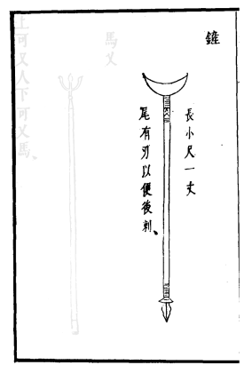

# References

<table width="100%">
  <tbody>
    <tr valign="top">
      <td width="50%" align="right">
        
      </td>
      <td>
        <ul>
          <li>Description: An image of Sha Wujing, or “Sandy” for short, is commonly portrayed in modern media wielding a Crescent Moon Spade (a.k.a. “Monk’s Spade“), a wooden polearm capped with a sharpened spade on one end and a crescent-shaped blade on the other.</li>
          <li><a href="https://journeytothewestresearch.com/2017/07/09/modern-depictions-of-sha-wujings-weapon-and-its-origins/">Source URL</a></li>
          <li><a href="https://i0.wp.com/journeytothewestresearch.com/wp-content/uploads/2017/07/ming-era-crescent-moon-spade.png?resize=284%2C420&ssl=1">Image URL</a></li>
        </ul>
      </td>
    </tr>
  </tbody>
</table>
